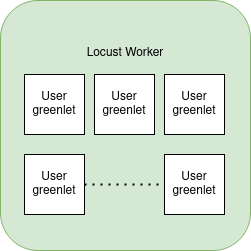
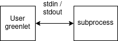

# Debugging Locust

Within this document, we'll attempt to provide
* solutions to common issues when building the nonclustered and clustered environment as well as
* a more extreme, or longer, method of getting more detail of what is wrong with your environent. 

The environment, at the moment, is notorious for not giving very detailed information when failures happen. Often times, resolving these specific errors comes down to pattern recognition or time within the environment. We will attempt to solve this issue by (a) providing you these "pattern recognitions" (e.g. shortcuts for specific issues) as well as (b) teaching how to elicit more information out of your environment. 

## How to Find Failures

Most likely, the first place you will see errors will be within the Locust `Failures` tab (during and after you run your particular test). This is the easiest place to start looking for errors, as it tells you which step the failure is happening on. Additionally, Locust can tell you specific information (see our [Specific Issues](##Specific-Issues) section) which can help you debug faster.

Further, Locust will, minimally, tell you which steps are failing. 
For example, consider a issuance and verification scenario to new connections using mediation. If a failure happens,
* with `on_start`, this could possibly indicate a problem with (a) the load agent itself or (b) the mediator. 
* with `get_invite`, this could possibly indicate a problem with the load agent being able to talk to ACA-Py. 
* with `accept_invite`, this also may be a problem with firewall rules or with ACA-Py. Also checking our "sanity check" below, within the ACA-Py section, would help. If this still doesn't provide more information, try below our [Ultimate Debugging](##Ultimate-Debugging) section. 
* with `receive_credential`, it might not be immediately apparent what the failure is. 
* with `presentation_exchange`, again, it might not be immediately apparent what the failure is. 

Fortunately, if Locust is able to provide information within the `Failures` tab on why it is having an issue, you may just come in luck: one of your failures could lie within our [Specific Issues](##Specific-Issues) section. Within this section, look for the pattern that your failure matches. 

If you have some direction on where to look (at least, which component), it is recommended to SSH into that component and sift through the logs. There will often be an outstanding error, generally with information about why it is raising errors. With luck, we've also included some errors that happen in the logs below that may help resolve your case quickly. 

Otherwise, if there is no helpful information or you are not sure where to begin, please see our [Ultimate Debugging](##Ultimate-Debugging) section. 

## Specific Issues

### General
* `/var/lib/docker` or `/docker` doesn't exist errors
    * Looks like:
    ```
    failed to solve: failed to read dockerfile: failed to prepare  as p34ian32fq5xslbkgyop2aosv: symlink ../p34ian32fq5xslbkgyop2aosv/diff /var/lib/docker/overlay2/l/TCX4JXUCDD5ABI2VUMPTEJLMN2: no such file or directory
    ```
    * How to fix:
        * Solution 1
        ```
        sudo systemctl restart docker
        ```
        * Solution 2
        ```
        sudo pkill -9 -f docker
        sudo systemctl disable docker docker.socket
        sudo rm -rf /var/lib/docker
        sudo systemctl start docker
        # If needed: sudo systemctl restart docker
        ```
        * Solution 3 (really, no different than solution 2, just another route)
        ```
        sudo pkill -9 -f docker
        sudo systemctl disable docker docker.socket
        cd /var/lib/
        sudo rm -rf docker/
        # Wait for it to remove
        # If busy, try shutting down and restarting VM
        cd ~
        sudo systemctl start docker
        # If needed: sudo systemctl restart docker
        ```

### ACA-Py
Generally, to make sure your ACA-Py agent is working correctly. A good sanity check is always to 
1. check the Admin UI, 
2. create a connection invitation, 
3. investigate the `invitation_url`,
    a. *Does the beginning of the invitation look correct?* (Non-Clustered) Does it match the external IP of ACA-Py? Or (Clustered) Does it match the transport (backend) DNS name?
    b. *Does the end port look correct?* (Non-Clustered) Does it end in `8151`? (Clustered) Does it end in `80`?
4. access the `invitation_url` via the browser.
    a. *Do you get an invitation?* *Can you access it?* If not, investigate firewall rules.
    b. If clustering, check load balancer target group and port mapping settings.

* **Pool Timeout Errors**
    * Looks like:
    ```
    ubuntu-issuer-1  | Traceback (most recent call last):
    ubuntu-issuer-1  |   File "/home/indy/.venv/lib/python3.9/site-packages/aries_cloudagent/commands/start.py", line 72, in init
    ubuntu-issuer-1  |     await startup
    ubuntu-issuer-1  |   File "/home/indy/.venv/lib/python3.9/site-packages/aries_cloudagent/commands/start.py", line 28, in start_app
    ubuntu-issuer-1  |     await conductor.setup()
    ubuntu-issuer-1  |   File "/home/indy/.venv/lib/python3.9/site-packages/aries_cloudagent/core/conductor.py", line 181, in setup
    ubuntu-issuer-1  |     if not await ledger_config(
    ubuntu-issuer-1  |   File "/home/indy/.venv/lib/python3.9/site-packages/aries_cloudagent/config/ledger.py", line 137, in ledger_config
    ubuntu-issuer-1  |     async with ledger:
    ubuntu-issuer-1  |   File "/home/indy/.venv/lib/python3.9/site-packages/aries_cloudagent/ledger/indy_vdr.py", line 308, in __aenter__
    ubuntu-issuer-1  |     await self.pool.context_open()
    ubuntu-issuer-1  |   File "/home/indy/.venv/lib/python3.9/site-packages/aries_cloudagent/ledger/indy_vdr.py", line 229, in context_open
    ubuntu-issuer-1  |     await self.open()
    ubuntu-issuer-1  |   File "/home/indy/.venv/lib/python3.9/site-packages/aries_cloudagent/ledger/indy_vdr.py", line 192, in open
    ubuntu-issuer-1  |     self.handle = await open_pool(transactions=txns, socks_proxy=self.socks_proxy)
    ubuntu-issuer-1  |   File "/home/indy/.venv/lib/python3.9/site-packages/indy_vdr/pool.py", line 177, in open_pool
    ubuntu-issuer-1  |     await pool.refresh()
    ubuntu-issuer-1  |   File "/home/indy/.venv/lib/python3.9/site-packages/indy_vdr/pool.py", line 58, in refresh
    ubuntu-issuer-1  |     await bindings.pool_refresh(self.handle)
    ubuntu-issuer-1  |   File "/usr/local/lib/python3.9/asyncio/futures.py", line 284, in __await__
    ubuntu-issuer-1  |     yield self  # This tells Task to wait for completion.
    ubuntu-issuer-1  |   File "/usr/local/lib/python3.9/asyncio/tasks.py", line 328, in __wakeup
    ubuntu-issuer-1  |     future.result()
    ubuntu-issuer-1  |   File "/usr/local/lib/python3.9/asyncio/futures.py", line 201, in result
    ubuntu-issuer-1  |     raise self._exception
    ubuntu-issuer-1  | indy_vdr.error.VdrError: Pool timeout
    ubuntu-issuer-1  |
    ubuntu-issuer-1  | Shutting down
    ubuntu-issuer-1  | 2023-11-08 17:55:56,521 aries_cloudagent.core.event_bus DEBUG Notifying subscribers: <Event topic=acapy::core::shutdown, payload={}>
    ubuntu-issuer-1  | 2023-11-08 17:55:56,522 aries_askar.native.aries_askar.backend.db_utils INFO 	src/backend/db_utils.rs:168 | Dropped pool connection
    ubuntu-issuer-1  | 2023-11-08 17:55:56,522 aries_askar.native.aries_askar.ffi.store INFO 	src/ffi/store.rs:413 | Closed store StoreHandle(1)
    ubuntu-issuer-1  | 2023-11-08 17:55:56,523 aries_askar.native.aries_askar.ffi.log DEBUG 	src/ffi/log.rs:130 | Removing custom logger
    ubuntu-issuer-1  | 2023-11-08 17:55:56,523 aries_askar.native.aries_askar.ffi.store INFO 	src/ffi/store.rs:1012 | Session not found for closing: SessionHandle(2)
    ubuntu-issuer-1 exited with code 0
    ```
    * How to Fix:
        * Generally, shut down the VM entirely. (Not just a down.) Restart it back up again. (See [CHECKLIST.md](CHECKLIST.md))

### Failure Tab Within Locust
* **Schema and/or Credential Definition Not Set**
    * Looks like:
    ```
    Exception(b'400: Issuer has no operable cred def for proposal spec...')
    ```
    * How to fix:
        * Anchor Schema and Credential Definition within ACA-Py Admin UI
        * Reflect in locust `.env`(s)
            * If clustered, reflect in launch templates too
        * Down, build, and up
* **Service Endpoint:** (a) `ISSUER` variable didn't get set within `.env` within Locust or Service Portion Wrong or (b) Wrong Endpoint Set
    * Looks like:
    ```
    Exception('Error encountered within load testing agent: ', {'error': 1, 'result': {'outboundMessageContext': {'message': {'@type': 'https://didcomm.org/connections/1.0/request', '@id': '85d4dbaf-408d-4157-81e2-edf2d209f44c', 'label': 'Gb1zPcpbqicr4c', 'connection': {'DID': '2n1zWc8PmD3Va5pF6SKZmZ', 'DIDDoc': {'@context': 'https://w3id.org/did/v1', 'publicKey': [{'id': '2n1zWc8PmD3Va5pF6SKZmZ#1', 'controller': '2n1zWc8PmD3Va5pF6SKZmZ', 'type': 'Ed25519VerificationKey2018', 'publicKeyBase58': 'y9aGD5A9c1QYta4C3n8eKrAT8cD4TMZdKW2AmoScmGn'}], 'service': [{'id': '2n1zWc8PmD3Va5pF6SKZmZ#IndyAgentService-1', 'serviceEndpoint': 'redacted', 'type': 'IndyAgent', 'priority': 0, 'recipientKeys': ['y9aGD5A9c1QYta4C3n8eKrAT8cD4TMZdKW2AmoScmGn'], 'routingKeys': ['5L7sNQkfzwt5GDwsRCDzQnj8crQeYTeoRWbDYyCmGFRt']}], 'authentication': [{'publicKey': '2n1zWc8PmD3Va5pF6SKZmZ#1', 'type': 'Ed25519SignatureAuthentication2018'}], 'id': '2n1zWc8PmD3Va5pF6SKZmZ'}}, '~thread': {'thid': '85d4dbaf-408d-4157-81e2-edf2d209f44c', 'pthid': '2160a989-7a6e-4ec6-b65b-3d20234ecd8b'}}, 'outOfBand': {'_tags': {'invitationId': '2160a989-7a6e-4ec6-b65b-3d20234ecd8b', 'recipientKeyFingerprints': ['z6Mki6BJBvZDzVAuusC7SkhJ5JuGRmE9pr1wvQ6aKCkggDwE'], 'state': 'initial', 'role': 'receiver', 'threadId': '2160a989-7a6e-4ec6-b65b-3d20234ecd8b'}, 'metadata': {'_internal/legacyInvitation': {'legacyInvitationType': 'connections/1.x'}}, 'id': '72a7d52b-d4a0-4ede-8501-806b5ff420e2', 'createdAt': '2023-12-02T17:38:22.774Z', 'outOfBandInvitation': {'@type': 'https://didcomm.org/out-of-band/1.1/invitation', '@id': '2160a989-7a6e-4ec6-b65b-3d20234ecd8b', 'label': 'Test', 'accept': ['didcomm/aip1', 'didcomm/aip2;env=rfc19'], 'handshake_protocols': ['https://didcomm.org/connections/1.0'], 'services': [{'id': '#inline', 'serviceEndpoint': 'http://{EXTERNAL_ACAPY_IP}}:8151', 'type': 'did-communication', 'recipientKeys': ['did:key:z6Mki6BJBvZDzVAuusC7SkhJ5JuGRmE9pr1wvQ6aKCkggDwE']}]}, 'role': 'receiver', 'state': 'prepare-response', 'autoAcceptConnection': True, 'reusable': False, 'updatedAt': '2023-12-02T17:38:22.779Z'}, 'agentContext': {'contextCorrelationId': 'default'}, 'connection': {'_tags': {}, 'metadata': {}, 'connectionTypes': [], 'id': '025c1bb8-6eea-4c7e-82ad-81540cf25cc6', 'createdAt': '2023-12-02T17:38:22.883Z', 'did': 'did:peer:1zQmc9Mqs7ZL5tpZG2tHEjBAAqfjm3cefRVAWQ4GWMTmQpG3', 'invitationDid': 'did:peer:2.SeyJzIjoiaHR0cDovLzU0LjE5Ny4xODMuNzY6ODE1MSIsInQiOiJkaWQtY29tbXVuaWNhdGlvbiIsInByaW9yaXR5IjowLCJyZWNpcGllbnRLZXlzIjpbImRpZDprZXk6ejZNa2k2QkpCdlpEelZBdXVzQzdTa2hKNUp1R1JtRTlwcjF3dlE2YUtDa2dnRHdFI3o2TWtpNkJKQnZaRHpWQXV1c0M3U2toSjVKdUdSbUU5cHIxd3ZRNmFLQ2tnZ0R3RSJdfQ', 'theirLabel': 'Test', 'state': 'request-sent', 'role': 'requester', 'autoAcceptConnection': True, 'threadId': '85d4dbaf-408d-4157-81e2-edf2d209f44c', 'mediatorId': '4fc004db-adea-4b3b-aed0-7dbc38f1bdae', 'protocol': 'https://didcomm.org/connections/1.0', 'outOfBandId': '72a7d52b-d4a0-4ede-8501-806b5ff420e2', 'updatedAt': '2023-12-02T17:38:22.886Z'}}}})
    ```
    * How to fix:
        * Look at the above failure
        * Investigate the service endpoint. Above, this looks like
            ```
            'serviceEndpoint': 'http://{EXTERNAL_ACAPY_IP}}:8151',
            ```
            * Nonclustered: 
                * Ensure `{EXTERNAL_ACAPY_IP}` is the external IP of your ACA-Py Admin UI. 
                * Ensure your port ends with `8151`. 
                * If the above is correct, can you access `http://{EXTERNAL_ACAPY_IP}}:8151`? (Should prompt file download)
                    * If not, investigate firewall rules.
            * Clustered: 
                * * Ensure `{EXTERNAL_ACAPY_IP}` matches the transport DNS name from your ACA-Py backend load balancer.
                * Ensure your port ends with `80`. 
                * If the above is correct, can you access `http://{EXTERNAL_ACAPY_IP}}:80`? (Should prompt file download)
                    * If not, investigate firewall rules.
                    * If so, investigate backend load balancer settings. (Target group and port mappings)


## Ultimate Debugging

### Structure

#### Subprocess Design

Each user in Locust is represented by a [gevent](https://www.gevent.org/) [greenlet](https://greenlet.readthedocs.io/en/latest/). This greenlet runs all of the tasks for each user. After completing the tasks, the greenlet will repeat all the tasks after some type of wait interval.

As we can see below, each greenlet represents a different User.



Greenlets works well when an individual user doesn't use too much CPU. In our case, we are doing some high CPU tasks, such as encryption and decryption of messages.

In this case, we have each gevent greenlet create a subprocess to handle the CPU intensive tasks. Commands are sent over stdin and responses are received over stdout.



The commands are sent as JSON and responses are received as JSON.

Example of a successful start command being sent and response:

```
stdin -> {"cmd": "start","withMediation": true,"port":"9999"}
stdout <- {"error":0,"result":"Initialized agent..."}
```

Example of a unsuccessful start command being sent and response:

```
stdin -> {"cmd": "start","withMediation": true,"port":"5555"}
stdout <- {"error":1,"result":{}} 
```

The design of the `agent.ts` is such that a single stdin request is made, and a single stdout response is received. This simple pattern is used for all of the commands issued to `agent.ts`.

This allows for manual testing of the interactions between Locust and agent.js. This pattern would also allow a new agent using Python or Rust to be defined as long as it followed the same input / output pattern.


#### locustClient.py

Locust provides some [details](https://docs.locust.io/en/stable/testing-other-systems.html#other-examples) on how to extend Locust to support other protocols. For extending Locust, a file was created called [locustClient.py](../load-agent/locustClient.py).

The `locustClient.py` file contains all calls to `agent.ts`. 

Locust uses an events class to report the success or failure of the calls. This is managed by the stopwatch decorator, which also records timing.

The `locustClient.py` call also makes API calls to the Issuer or Verifier to obtain invitations, issue credentials, verify credentials, etc. This bypasses QR code generation, but this usually isn't a concern as QR codes are usually generated client side. State is returned from each of these calls, allowing connection_id, credential details, etc to be used in a later step.

All the other `locust*.py` files are separate tests that extend the functionality defined in `locustClient.py`.

For more specific information on what each of the functions do, either (a) investigate the `locustClient.py` file or (b) view our [DESIGN.md](./DESIGN.md). For now, to get you up and running, we'l run through an example of how to go about these debugging steps. 

### Entering Debugging Mode

In order to get information out of your environment, it's better to either focus on just one locust component (either your locust `master` or `worker`). Down that locust environment, if you haven't already, with
```
sudo docker-compose down -v
```
In order to get more logging information, `vim load-agent/agent.ts` and uncomment
```
// logger: new ConsoleLogger(LogLevel.trace)
```
so we have
```
logger: new ConsoleLogger(LogLevel.trace)
```
Save with `:wq`. Then, `build` and `up` your environment again, using whatever methods you used to initially build and up it in the first place (e.g. nonclustered vs. clustered). If you were using the nonclustered environment, do `sudo docker-compose -f docker-compose.yml build && sudo docker-compose -f docker-compose.yml up -d`; otherwise, if you're within the locust worker, try `sudo docker-compose -f worker.docker-compose.yml build && sudo docker-compose -f worker.docker-compose.yml up -d`. 

From here, because the logger is on, the tests will not work in the browser (so, once you're done here, don't forget to comment the logger back out!). 

*Before we manually debug, please `vim .env` and make sure to copy your `CRED_DEF`, `SCHEMA`, and `CRED_ATTR` (as we won't be able to readily view them later on).*

Next, type in `sudo docker ps`. This will give you information about the container running in the VM. Copy the container ID (the left-most column value). Let's call this `{container_id}`. 

Then, type in `sudo docker exec -it {container_id} /bin/bash`, where the `{container_id}` is the aforementioned container ID you just copied. This will bring you into the container. 

From here, we'll want to essentially do the load test by hand. Type in `ts-node agent.ts`. We are now running the tests.

You can run, virtually, any test you would like (that is, the methods you're calling actually have to have written code within `locustClient.py` and `agent.ts`). We will run through a specific example but, for any other scenario, this can be abstracted by running (a) the respective JSON commands within the function of `locustClient.py` and (b) (if necessary) executing the API calls (within your admin interface) corresponding to the same respective function within `locustClient.py`.

### Issuance and Verification Example

#### Instantiate Agent

To instantiate an agent with mediation, enter
```
{"cmd": "start","withMediation": true,"port":"9999"}
```
(you will have to make sure your `MEDIATION_URL` is set within your `.env` though). 

To instantiate an agent without mediation, enter
```
{"cmd": "start","withMediation": false,"port":"9999"}
```
Each of these commands (if successful), respectively, should return something of the type 
```
{"error":0,"result":"Initialized agent..."}
```
within the logs. If it doesn't, investigate.

#### Forming a Connection

##### Regular Connection

To form a connection, head to your admin API. Authorize yourself if needed. Then, head down to the sections `connections` and head to the post method `/connections/create-invitation`. Click on the box `Try it out` and, within the body, modify the input box such that
```
{
    metadata: {}
}
```
is the only thing within the box. Then, click on the blue `Execute` button. Within the (top) response box, **copy the `connection_id`**. Record this down somewhere, as we'll need it later. Also copy the **`invitation_url`**. 

Then, back within your terminal where you executed `ts-node agent.ts`, put in
```
{"cmd":"receiveInvitation", "invitationUrl": "INVITATION_URL"}
```
where the above `INVITATION_URL` is the `invitation_url` you copied from earlier. If the above command is successful, you should receive something back like
```
{"error":0,"result":"Receive Connection", ...}
```
where the `...` respresents more information following the first bit. If you did NOT receive something like this within the logs, the problem within your environment likely lies within your ACA-Py environment. Now would be a good time, using the `invitation_url` you copied, to see if YOU can access this `invitation_url` (paste it into your browser). Now would also be a good time to check (a) your environment variables (does that `invitation_url` end in `8151` for non-clustered or `80` for your clustered envirornment?) and/or (b) your necessary firewall rules.

##### Out-of-Band Connection

If you're forming an OOB connection, the steps will be very similar to above. Head to the ACA-Py Admin UI. If needed, authorize yourself.

Head to the `out-of-band` section. Click on the green POST method `/out-of-band/create/invitation`. Click ont he box `Try it out` and, within the body, modify the input box such that
```
{
  "handshake_protocols": [
    "https://didcomm.org/connections/1.0"
  ],
  "metadata": {}
}
```
is the only thing within the box. Click on the blue `Execute` button. From the (top) response box, copy the `invi_msg_id`. Save this for later. Then, copy the `invitation_url`. 

Then, back within your terminal where you executed `ts-node agent.ts`, put in
```
{"cmd":"receiveInvitation", "invitationUrl": "INVITATION_URL"}
```
where the above `INVITATION_URL` is the `invitation_url` you copied from earlier. If the above command is successful, you should receive something back like
```
{"error":0,"result":"Receive Connection", ...}
```
where the `...` respresents more information following the first bit. If you did NOT receive something like this within the logs, the problem within your environment likely lies within your ACA-Py environment. Now would be a good time, using the `invitation_url` you copied, to see if YOU can access this `invitation_url` (paste it into your browser). Now would also be a good time to check (a) your environment variables (does that `invitation_url` end in `8151` for non-clustered or `80` for your clustered envirornment?) and/or (b) your necessary firewall rules.

For the out-of-band portion, we'll also need a connection ID. To get this connection ID, head to the `connections` section at the top of the page [of the ACA-Py Admin UI]. Click on the blue GET `/connections` box. Then, click on the `Try it out` box. Within the box titled `invitation_msg_id`, go ahead and paste your `invi_msg_id` from earlier. Then, click on the blue `Execute` button.

From here, the response box should return a single result. Copy the connection ID. (And that's it!) 

#### Issue Credential

Now, in order to issue a credential, we'll need to prepare the endpoint within your ACA-Py Admin UI. 

Head to the `issuer-credential-v1.0` section, then click on the green POST `/issue-credential/send` section. Press on the button `Try it out`. In the `body` section, fill out the issue credential section
```
{
  "auto_remove": true,
  "comment": "string",
  "connection_id": "CONNECTION_ID",
  "cred_def_id": "CRED_DEF",
  "credential_proposal": {
    "@type": "issue-credential/1.0/credential-preview",
    "attributes": CRED_ATTR
  },
  "issuer_did": "DID",
  "schema_id": "SCHEMA",
  "schema_issuer_did": "DID",
  "schema_name": "prefs",
  "schema_version": "1.0",
  "trace": true
}
```
where `CONNECTION_ID` is the connection ID you copied from earlier during the connection step, `CRED_DEF` is the `CRED_DEF` from your `.env`, `CRED_ATTR` is the `CRED_ATTR` from your `.env` , `DID` is the first portion of your `SCHEMA` (from your `.env`) (before the `:`), and where `SCHEMA` is from your `.env`. After filling this out, ***do not press `Execute` yet***. 

Rather, head back to the terminal, and paste in
```
{"cmd": "receiveCredential"}
```
Then, head back to the ACA-Py Admin UI and press the blue `Execute` button. If all was successful, you should have an output of
```
{"error":0,"result":"Receive Credential"}
```
If you were not able to press the blue `Execute` button within the ACA-Py admin UI, double check that the JSON you put in the `body` box is correct. It might help to go ahead and search up a JSON formatter online to help point out extra commas or brackets, etc.

If all was not successful, see the above [forming connection] section for debugging information for ACA-Py. Otherwise, try investigating the logs of the ACA-Py Agent with `sudo docker-compose logs`.


#### Present Credential

Similarly, for this section, we'll prepare our ACA-Py Admin UI portion first. 

Now, in order to issue a credential, we'll need to prepare the endpoint within your ACA-Py Admin UI. 

Head to the `present-proof v1.0` section, then click on the green POST `/present-proof/send-request` section. Press on the button `Try it out`. In the `body` section, fill out the present proof section
```
{
  "auto_remove": false,
  "auto_verify": true,
  "comment": "Perf Verification",
  "connection_id": "CONNECTION_ID",
  "proof_request": {
    "name": "Proof request",
    "nonce": "1",
    "requested_attributes": {
      "additionalProp1": {
        "name": "score"
      }
    },
    "requested_predicates": {},
    "version": "1.0"
  },
  "trace": true
}
```
where `CONNECTION_ID` is the connection ID you copied from earlier. If you did not go with the default `SCHEMA`, you'll want to (within the `requested_attributes` section), add `additionalProp1`, `additionalProp2`, ..., `additionalPropn` for each of the `n` attributes you have within your `CRED_ATTR`, along with their respective names. After filling this out, ***do not press `Execute` yet***. 

Rather, head back to the terminal, and paste in
```
{"cmd": "presentationExchange"}
```
Then, head back to the ACA-Py Admin UI and press the blue `Execute` button. If all was successful, you should have an output of
```
{"error":0,"result":"Presentation Exchange"}
```

If you were not able to press the blue `Execute` button within the ACA-Py admin UI, double check that the JSON you put in the `body` box is correct. It might help to go ahead and search up a JSON formatter online to help point out extra commas or brackets, etc.

If all was not successful, see the above [forming connection] section for debugging information for ACA-Py. Otherwise, try investigating the logs of the ACA-Py Agent with `sudo docker-compose logs`.

And that's it! Hopefully, during some step of this process, you extracted out more useful logs. Once you get everything to return all successful results, (in theory) everything should be working (and you should be able to uncomment out the logger and run the load test via the browser like normal).

