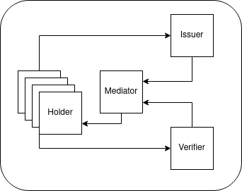
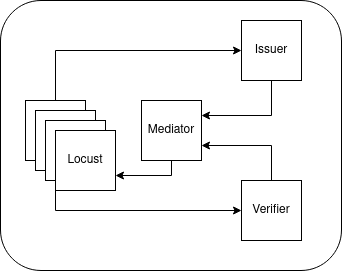
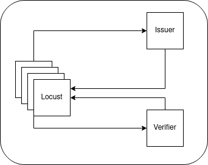

# Aries Akrida Design

Typically, three to four types of agents may be involved in a decentralized identity environment. There is typically a large number of holder agents, a mediator agent for the holder agents, and one or more issuer and verifier agents. In some environments, a mediator agent isn't required as the holder agents do not have dynamic IP addresses.

Example of a typical environment with a mediator:



Example of a typical environment without mediator:


Aries Akrida takes the place of the holder agents, as the typical case for load testing is to test the server infrastructure of environments. In this case the server infrastructure includes the mediator, issuer, and verifier agents. The holder agent is the client.

Example of Locust with a mediator:



Example of Locust without mediator:



Locust can run multiple holder agents per Locust instance. This can be controlled by a master Locust instance.


Main Design Requirements
- Use proven load scale platform ( Locust )
- Support scaling with the use of clustering ( Locust )
- Provide easy to use interface with metrics ( Locust )
- Ensure each user scales independently ( Independent Aries Framework Javascript Subprocesses )
- Simulate real world clients ( Aries Framework Javascript )
- Open Source License
- Community around existing tools

Aries Akrida was built using the following code bases.

- Locust
- Aries Framework Javascript

Locust is already a proven open source solution for load testing various environments. While Locust's main focus is on performance of HTTP based interfaces, Locust has the ability to be extended to support other protocols.

Aries Akrida uses Aries Framework Javascript for the DIDComm protocol. Aries Framework Javascript was chosen because many DIDComm clients are written and use Aries Framework Javascript. By using Aries Framework Javascript as the client, Aries Akirda can best simulate real world clients.

Aries Akrida uses a subprocess's stdin/stdout to call Aries Framework Javascript from Locust. Other Frameworks could be used in place of Aries Framework Javascript as long as the implement the same calls.

## Why Locust

While there are some over-arching goals when picking a load testing framework, such as

- Clustering / Scaling
- Simplicity
- Community
- Open Source License
- Extendable

We also want the framework to be easy to develop against, and something the community is familiar with. This means that the programming languages for the testing framework are going to be either Python or Javascript. 

After reviewing Locust, Molotov, JMeter, Taurus, nGrinder, The Grinder, k6, Tsung, and Siege, we found that Locust had the simplest interface to bring up and manage, was very capable, and was easily extendable. This is not saying the other frameworks aren't capable frameworks, but we found that for us, Locust was the best choice.

## Subprocess Design

Each user in Locust is represented by a [gevent](https://www.gevent.org/) [greenlet](https://greenlet.readthedocs.io/en/latest/). This greenlet runs all of the tasks for each user. After completing the tasks, the greenlet will repeat all the tasks after some type of wait interval.

As we can see below, each greenlet represents a different User.


Greenlets works well when an individual user doesn't use too much CPU. In our case, we are doing some high CPU tasks, such as encryption and decryption of messages.

In this case, we have each gevent greenlet create a subprocess to handle the CPU intensive tasks. Commands are sent over stdin and responses are received over stdout.


The commands are sent as JSON and responses are received as JSON.

Example of a successful start command being sent and response:

```
stdin -> {"cmd": "start","withMediation": true,"port":"5555"}
stdout <- {"error":0,"result":"Initialized agent..."}
```

Example of a unsuccessful start command being sent and response:

```
stdin -> {"cmd": "start","withMediation": true,"port":"5555"}
stdout <- {"error":1,"result":{}} 
```

The design of the agent.js is such that a single stdin request is made, and a single stdout response is received. This simple pattern is used for all of the commands issued to agent.js.

This allows for manual testing of the interactions between Locust and agent.js. This pattern would also allow a new agent using Python or Rust to be defined as long as it followed the same input / output pattern.


## locustClient.py

Locust provides some [details](https://docs.locust.io/en/stable/testing-other-systems.html#other-examples) on how to extend Locust to support other protocols. For extending Locust, a file was created called [locustClient.py](../load-agent/locustClient.py).

The locustClient.py file contains all calls to agent.js. 

Locust uses an events class to report the success or failure of the calls. This is managed by the stopwatch decorator, which also records timing.

The locustClient.py call also makes API calls to the Issuer or Verifier to obtain invitations, issue credentials, verify credentials, etc. This bypasses QR code generation, but this usually isn't a concern as QR codes are usually generated client side. State is returned from each of these calls, allowing connection_id, credential details, etc to be used in a later step.

All the other locust*.py files are separate tests that extend the functionality defined in locustClient.py.

### startup

The startup function is to use the subprocess function to startup the agent.js service. It also calls the command start function inside of agent.js.

The function also works with the PortManager, which is responsible for handling which ports each agent.js may use, to obtain a port for that specific User agent.js combo. So, for example, if ports 10000-10500 are exposed via the docker-compose.yml file, these 500 ports will be used for each of the users. If there’s one worker agent, maximally we can go to 500 workers. If there’s three worker agents, maximally we can go to 3*500=1500 workers.

In some cases, the startup may fail, in which case, an Exception is thrown, and the subprocess is shutdown. The various tests will attempt to restart the subprocess, but some states may not be recoverable and restarting Locust may be required.

### shutdown

The shutdown function is designed to terminate the agent.js subprocess. If the process fails to terminate, a best effort is made to kill the process by using the os.kill command.

### ensure_is_running

The ensure_is_running command is designed to check the status of the subprocess. While under intense load, unexpected situations can occur. These unexpected situations can result in a process crashing. Load tests can check the status of the subprocess, and potentially reset the subprocess code. The ensure_is_running will call the startup command again if the subprocess is not running. Other calls may need to be made for the test to recover, such as forming a connection with an issuer.

### run_command

The run_command function is designed to send a command to the agent.js file.

### readjsonline

The readjsonline function receives the response from the agent.js. If too many errors have occurred, the function will trigger a shutdown of the agent. This is to prevent cascading errors from impacting new cycles of the test.

### ping_mediator

This call runs the ping_mediator function. The goal of the ping_mediator function is to ensure that the agent is currently connected to the mediator without the involvement of any other agents, such as an Issuer or Verifier.

### issuer_getinvite

This function gets an invitation from an issuer.

### issuer_getliveness

This function tests the status of an issuer

### accept_invite

This function has the agent.js accept an invitation from an issuer or verifier.

### receive_credential

This function instructs the agent.js to accept a credential. This function will also instruct the issuer to send a credential as defined in the .env file.

### revoke_credential

This function tests revoking a credential.

### msg_client

This function tests sending a message from the issuer to the agent.js.

## locustIssue.py

locustIssue.py is designed to test issuing credentials. 

## locustMediatorIssue.py

locustIssue.py is designed to test issuing credentials using a mediator.

## locustIssueMsg.py

locustIssueMsg.py is designed to test sending messages from the issuer to the AFJ Client.

## locustMediatorMsg.py

locustMediatorMsg.py is designed to test sending messages from the issuer to the AFJ Client using the mediator.

## locustMediatorPing.py

locustMediatorPing.py is designed to test the number of agents that can connect to a mediator. A ping will be sent to the mediator and return via the websocket connection to ensure the agent is still connected.

## locustLiveness.py

locustLiveness.py is designed to test the issuer's /status REST API Call.

## Subprocess Commands - agent.js

The agent.js is an event based architecture. It has a readline loop that listens for incoming commands. Commands are json strings. Examples

```
{"cmd":"start"}
{"cmd":"ping_mediator"}
{"cmd":"shutdown"}
```

### commmand: start 

cmd: start

description: Runs the initialization of the Aries Framework Javascript agent, including any connections to mediators. The startup command must be run before any other commands.

parameters: withMediation, port

withMediation: withMediation accepts a boolean value. With mediation indicates that Aries Framework Javascript should use the mediator defined in the .env file.

port: if withMediation is false, a port must be defined for agent.js to use for incoming DIDComm messages. The port must be mapped in docker-compose and the firewall so external services can access the port. The .env file specifies a starting and ending port. If more processes are started than ports are mapped, it can cause the Locust process to hang. If a large number of ports are mapped, it can cause a significant delay in docker-compose starting up.

Examples: 

Successful command

```
stdin -> {"cmd": "start","withMediation": true,"port":"5555"}
stdout <- {"error":0,"result":"Initialized agent..."}
```

Unsuccessful command

```
stdin -> {"cmd": "start","withMediation": true,"port":"5555"}
stdout <- {"error":1,"result":{}} 
```

### command: shutdown 

cmd: shutdown

description: Cleanly shuts down the Aries Framework Javascript agent and terminates the agent.js process. If the shutdown command is unsuccessful within the defined timeout, Locust will kill the subprocess.

parameters: None

Examples: 

Successful command

```
stdin -> {"cmd": "start","withMediation": true,"port":"5555"}
stdout <- {"error":0,"result":"Initialized agent..."}
stdin -> {"cmd":"shutdown"}
stdout <- {"error":0,"result":"Shutting down agent"}
```

### command: ping_mediator 

cmd: ping_mediator

description: The Ping Mediator command sends a trust ping to the mediator agent with response_requested. The mediator agent will then respond with ping-response over the mediation connection. This is used to verify agents are connected to the mediator. This is useful to test that an agent is still connected to the mediator. This function is used when testing the number of agents that can be connected to the mediator at the same time. If the Ping Mediator command doesn't respond within the specified timeout in the .env, an error will be received.

parameters: None

Examples:

Successful command

```
stdin -> {"cmd": "start","withMediation": true,"port":"5555"}
stdout <- {"error":0,"result":"Initialized agent..."}
stdin -> {"cmd":"ping_mediator"}
stdout <- {"error":0,"result":"Ping Mediator"}
```

Unsuccessful command

```
stdin -> {"cmd": "start","withMediation": true,"port":"5555"}
stdout <- {"error":1,"result":{}} 
stdin -> {"cmd":"ping_mediator"}
stdout <- {"error":1,"result":"Mediator timeout!"}
```

### command: receiveInvitation

cmd: receiveInvitation

description: This command receives an invitation from an issuer, verifier, or other didcomm agent. The command will return when the connection is in active state, or return an error on failure.

parameters: invitationUrl

invitationUrl: this is the url for the DIDComm invitation

Examples:

Successful command

```
stdin -> {"cmd": "start","withMediation": true,"port":"5555"}
stdout <- {"error":0,"result":"Initialized agent..."}
stdin -> {"cmd":"receiveInvitation", "invitationUrl": "https://ys40cgl5r2.execute-api.us-east-1.amazonaws.com/Prod/message?c_i=eyJAdHlwZSI6ICJkaWQ6c292OkJ6Q2JzTlloTXJqSGlxWkRUVUFTSGc7c3BlYy9jb25uZWN0aW9ucy8xLjAvaW52aXRhdGlvbiIsICJAaWQiOiAiZGRkY2M4NTYtZTU5MS00NzM3LWIyN2ItYmFkNzliZGQxZjMyIiwgInJlY2lwaWVudEtleXMiOiBbIjZ2OW1LSExGSDdDbVI4am5wVXZGY05OcUxybnZiY0hQazZvNGtaTHFSdDNrIl0sICJzZXJ2aWNlRW5kcG9pbnQiOiAiaHR0cHM6Ly95czQwY2dsNXIyLmV4ZWN1dGUtYXBpLnVzLWVhc3QtMS5hbWF6b25hd3MuY29tL1Byb2QvbWVzc2FnZSIsICJsYWJlbCI6ICJCb2IiLCAicm91dGluZ0tleXMiOiBbIjJrQXh1SnhEaUxjOGRGa2tncVM2WXBjS291RlJIVFUzUldyWjd6ZHZNZkhXIiwgIkZWUFJhZXZvRkhXVXJDaFFoa2UzMngyR1g4RnJLd3lob0JYN2h5M05SaHJqIl19"}
stdout <- {"error":0,"result":"Receive Connection","connection":{"_tags":{"role":"receiver","state":"initial","invitationId":"9337c8c3-bf14-4073-9d55-4398ba8456cd","recipientKeyFingerprints":["z6Mktevz4sdGgHwTBGXQwmYSis9B4rNhP5Bcuqf1nuYLVthm"]},"metadata":{},"id":"9a678433-b844-4ef3-9992-710d32e4084c","createdAt":"2023-10-10T14:09:59.489Z","outOfBandInvitation":{"@type":"https://didcomm.org/out-of-band/1.1/invitation","@id":"9337c8c3-bf14-4073-9d55-4398ba8456cd","label":"Bob","accept":["didcomm/aip1","didcomm/aip2;env=rfc19"],"handshake_protocols":["https://didcomm.org/connections/1.0"],"services":[{"id":"#inline","serviceEndpoint":"https://ys40cgl5r2.execute-api.us-east-1.amazonaws.com/Prod/message","type":"did-communication","recipientKeys":["did:key:z6Mktevz4sdGgHwTBGXQwmYSis9B4rNhP5Bcuqf1nuYLVthm"],"routingKeys":["did:key:z6MkgCS1VZCf3t6bjkbTNQPwPvAKdUXGhLiQ7XmUxGbwGt4t","did:key:z6MktweUAuBEapzwxhY7PKbst3aGLhXhjqE4VCS3YF1PLve7"]}]},"role":"receiver","state":"prepare-response","autoAcceptConnection":true,"reusable":false}}
```

Unsuccessful command

```
stdin -> {"cmd": "start","withMediation": true,"port":"5555"}
stdout <- {"error":1,"result":{}} 
stdin -> {"cmd":"receiveInvitation", "invitationUrl": "https://ys40cgl5r2.execute-api.us-east-1.amazonaws.com/Prod/message?c_i=eyJAdHlwZSI6ICJkaWQ6c292OkJ6Q2JzTlloTXJqSGlxWkRUVUFTSGc7c3BlYy9jb25uZWN0aW9ucy8xLjAvaW52aXRhdGlvbiIsICJAaWQiOiAiODIzNzE2NWUtMDJkNi00ZWE1LTg2MGItOWRhNGJiYTcxYzdkIiwgInJlY2lwaWVudEtleXMiOiBbIjR2UDd0MWI0ZWhlTXJwVjJrVUdTQUNqM2plbmkyUDJ1M0xmSkpaa0RWc3lHIl0sICJzZXJ2aWNlRW5kcG9pbnQiOiAiaHR0cHM6Ly95czQwY2dsNXIyLmV4ZWN1dGUtYXBpLnVzLWVhc3QtMS5hbWF6b25hd3MuY29tL1Byb2QvbWVzc2FnZSIsICJsYWJlbCI6ICJCb2IiLCAicm91dGluZ0tleXMiOiBbIjJrQXh1SnhEaUxjOGRGa2tncVM2WXBjS291RlJIVFUzUldyWjd6ZHZNZkhXIiwgIkZWUFJhZXZvRkhXVXJDaFFoa2UzMngyR1g4RnJLd3lob0JYN2h5M05SaHJqIl19"}
stdout <- {"error":1,"result":{}}
```

### command: receiveCredential

cmd: receiveCredential

description: This command receives an credential from an issuer. The command will return when the credential has been received, or return an error on failure.

parameters:

invitationUrl: this is the url for the DIDComm invitation

Examples:

```
stdin -> {"cmd": "start","withMediation": true,"port":"5555"}
stdout <- {"error":0,"result":"Initialized agent..."}
stdin -> {"cmd":"receiveInvitation", "invitationUrl": "https://ys40cgl5r2.execute-api.us-east-1.amazonaws.com/Prod/message?c_i=eyJAdHlwZSI6ICJkaWQ6c292OkJ6Q2JzTlloTXJqSGlxWkRUVUFTSGc7c3BlYy9jb25uZWN0aW9ucy8xLjAvaW52aXRhdGlvbiIsICJAaWQiOiAiZGRkY2M4NTYtZTU5MS00NzM3LWIyN2ItYmFkNzliZGQxZjMyIiwgInJlY2lwaWVudEtleXMiOiBbIjZ2OW1LSExGSDdDbVI4am5wVXZGY05OcUxybnZiY0hQazZvNGtaTHFSdDNrIl0sICJzZXJ2aWNlRW5kcG9pbnQiOiAiaHR0cHM6Ly95czQwY2dsNXIyLmV4ZWN1dGUtYXBpLnVzLWVhc3QtMS5hbWF6b25hd3MuY29tL1Byb2QvbWVzc2FnZSIsICJsYWJlbCI6ICJCb2IiLCAicm91dGluZ0tleXMiOiBbIjJrQXh1SnhEaUxjOGRGa2tncVM2WXBjS291RlJIVFUzUldyWjd6ZHZNZkhXIiwgIkZWUFJhZXZvRkhXVXJDaFFoa2UzMngyR1g4RnJLd3lob0JYN2h5M05SaHJqIl19"}
stdout <- {"error":0,"result":"Receive Connection","connection":{"_tags":{"role":"receiver","state":"initial","invitationId":"9337c8c3-bf14-4073-9d55-4398ba8456cd","recipientKeyFingerprints":["z6Mktevz4sdGgHwTBGXQwmYSis9B4rNhP5Bcuqf1nuYLVthm"]},"metadata":{},"id":"9a678433-b844-4ef3-9992-710d32e4084c","createdAt":"2023-10-10T14:09:59.489Z","outOfBandInvitation":{"@type":"https://didcomm.org/out-of-band/1.1/invitation","@id":"9337c8c3-bf14-4073-9d55-4398ba8456cd","label":"Bob","accept":["didcomm/aip1","didcomm/aip2;env=rfc19"],"handshake_protocols":["https://didcomm.org/connections/1.0"],"services":[{"id":"#inline","serviceEndpoint":"https://ys40cgl5r2.execute-api.us-east-1.amazonaws.com/Prod/message","type":"did-communication","recipientKeys":["did:key:z6Mktevz4sdGgHwTBGXQwmYSis9B4rNhP5Bcuqf1nuYLVthm"],"routingKeys":["did:key:z6MkgCS1VZCf3t6bjkbTNQPwPvAKdUXGhLiQ7XmUxGbwGt4t","did:key:z6MktweUAuBEapzwxhY7PKbst3aGLhXhjqE4VCS3YF1PLve7"]}]},"role":"receiver","state":"prepare-response","autoAcceptConnection":true,"reusable":false}}
stdin -> {"cmd": "receiveCredential"}
stdout <- {"error":0,"result":"Receive Credential"}
```

